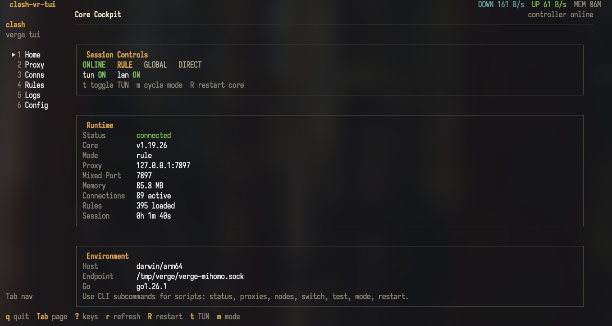
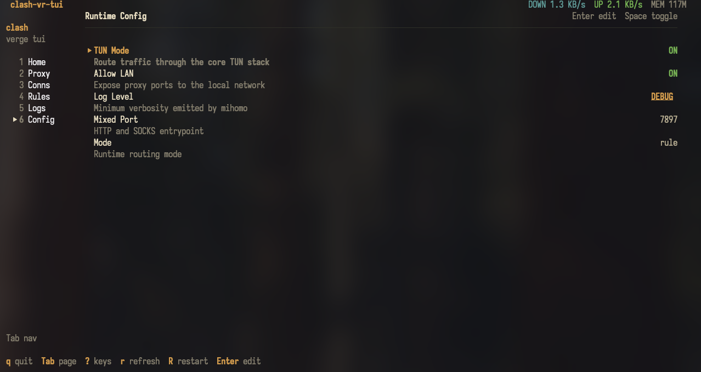

# clash-vr-tui

[](https://github.com/lr00rl/clash-vr-tui/actions/workflows/ci.yml)
[](https://github.com/lr00rl/clash-vr-tui/actions/workflows/release.yml)

A terminal UI (and CLI) for the **mihomo** core behind **Clash Verge Rev** — built
for driving your proxy from a pure terminal, including over SSH on a remote
Linux/macOS box. It talks to the mihomo controller over the Unix socket
(`/tmp/verge/verge-mihomo.sock`) or a TCP external-controller, and ships as a
single static binary with no runtime dependencies.

## Screenshots

<p>
  
</p>

<p>
  
</p>

## Quickstart

Install the latest release on Linux or macOS:

```sh
curl -fsSL https://raw.githubusercontent.com/lr00rl/clash-vr-tui/main/scripts/install.sh | sh
```

If no tagged release has been published yet, build from source:

```sh
git clone https://github.com/lr00rl/clash-vr-tui.git
cd clash-vr-tui
make build
./clash-vr-tui
```

Then run the TUI on the same machine as Clash Verge Rev / mihomo:

```sh
clash-vr-tui
```

If your mihomo controller is exposed over TCP instead of the Verge Unix socket:

```sh
clash-vr-tui --server 127.0.0.1:9090 --secret your-secret
```

For a non-interactive smoke test over SSH:

```sh
clash-vr-tui status
```

## Features

- **Home** — core status, version, mode, ports, live memory and active-connection
  count, restart the core (`R`).
- **Proxies** — two-panel groups / nodes view for 140+ node groups:
  - select a node (`Enter`), color-coded delays, sort by default/name/delay (`o`)
  - **three latency test modes** cycled with `T`:
    - **HTTP** — mihomo's delay test through the tunnel (per-group test URL)
    - **TCP** — raw connect to the node's `server:port`
    - **ICMP** — echo round-trip to the node's server
  - delay-aware filtering: `delay<200`, `delay>500`, `delay=timeout`, or a name
    substring (`/`)
  - unpin a URLTest/Fallback group back to auto (`u`)
- **Connections** — live connection table with per-connection speed, sort, filter,
  close one (`x`) / all (`X`), and a detail view (`Enter`).
- **Rules** — searchable routing rules.
- **Logs** — live `WS /logs` stream with level filter (`l`), text filter (`/`),
  pause (`space`), and clear (`c`).
- **Config** — terminal-safe controls for TUN, LAN exposure, log level, mixed
  port and runtime mode.

> **Note on TCP/ICMP:** the mihomo API does not expose node server addresses, so
> these modes parse the running mihomo config to find each `server:port`. They
> depend on the box being able to resolve the server hostname and the server
> answering — many obfuscated/CDN nodes only resolve through the tunnel, so the
> **HTTP** delay test remains the most reliable signal.

## Install

### Release installer

The installer downloads a release archive, verifies it against `checksums.txt`
when `sha256sum` or `shasum` is available, and installs to `~/.local/bin` by
default.

```sh
curl -fsSL https://raw.githubusercontent.com/lr00rl/clash-vr-tui/main/scripts/install.sh | sh
```

Common overrides:

```sh
BINDIR=/usr/local/bin sh -c "$(curl -fsSL https://raw.githubusercontent.com/lr00rl/clash-vr-tui/main/scripts/install.sh)"
VERSION=v0.1.0 sh -c "$(curl -fsSL https://raw.githubusercontent.com/lr00rl/clash-vr-tui/main/scripts/install.sh)"
```

### Manual download

Download the archive for your platform from
[GitHub Releases](https://github.com/lr00rl/clash-vr-tui/releases), unpack it,
and put `clash-vr-tui` on your `PATH`.

Release asset names:

| Platform | Asset |
|----------|-------|
| Linux x86_64 | `clash-vr-tui_linux_amd64.tar.gz` |
| Linux arm64 | `clash-vr-tui_linux_arm64.tar.gz` |
| macOS Intel | `clash-vr-tui_darwin_amd64.tar.gz` |
| macOS Apple Silicon | `clash-vr-tui_darwin_arm64.tar.gz` |
| Windows x86_64 | `clash-vr-tui_windows_amd64.zip` |
| Windows arm64 | `clash-vr-tui_windows_arm64.zip` |

### Build from source

```sh
make build          # -> ./clash-vr-tui
make install        # -> /usr/local/bin/clash-vr-tui (PREFIX overridable)
make dist           # cross-compile release binaries into dist/
```

Requires Go 1.25+.

## Supported Platforms

| Platform | Status | Notes |
|----------|--------|-------|
| Linux amd64 / arm64 | Primary | Best fit for SSH usage. Supports Unix socket and TCP controller connections. |
| macOS amd64 / arm64 | Primary | Works with Clash Verge Rev's default Unix socket path. |
| Windows amd64 / arm64 | Secondary | Use `--server host:port`; the default Verge Unix socket path is not available. |

The TUI is designed for real terminals over SSH. It does not require a desktop
environment, and the CLI subcommands are intended for scripts and automation.

## Usage

Launch the interactive TUI:

```sh
clash-vr-tui                          # auto-detects the verge socket
clash-vr-tui --socket /path/to.sock
clash-vr-tui --server 127.0.0.1:9090 --secret mypw   # external controller
```

### CLI (scriptable, no TUI)

```sh
clash-vr-tui status [--json]              # version, mode, ports, memory, conns
clash-vr-tui proxies                      # groups with their current node
clash-vr-tui nodes <group>                # nodes in a group with last delay
clash-vr-tui switch <group> <node>        # select a node
clash-vr-tui test <group> [--timeout MS]  # HTTP delay-test, sorted
clash-vr-tui mode [rule|global|direct]    # get or set the proxy mode
clash-vr-tui restart                      # restart the core
clash-vr-tui conns [--json]               # active connections
```

Example:

```sh
clash-vr-tui test for-test-ip --timeout 3000
clash-vr-tui switch for-test-ip 'JP-Tokyo-01'
clash-vr-tui status --json | jq .mode
```

## Keybindings

| Scope | Keys |
|-------|------|
| Global | `Tab`/`Shift+Tab` page · `1`–`6` jump · `?` help · `r` refresh · `R` restart core · `q`/`Ctrl+C` quit |
| Proxies | `←→`/`hl` panel · `j`/`k` move · `Ctrl+d`/`Ctrl+u` half-page · `g`/`G` top/bottom · `Enter` select · `d`/`D` test · `T` test mode · `o` sort · `u` unpin · `/` filter |
| Connections | `Enter` detail · `x` close · `X` close all · `s` sort · `/` filter |
| Rules | `g`/`G` top/bottom · `/` filter |
| Logs | `space` pause · `l` level · `c` clear · `/` filter |
| Config | `Enter` edit · `Space` toggle · `j`/`k` move |

While a filter input is open, every key (including `q`) types into it; `Esc`
closes it. `Ctrl+C` always quits.

## Configuration

Connection settings resolve from **flags > env > config file > defaults**:

- env: `CLASH_VR_TUI_SOCKET`, `CLASH_VR_TUI_SERVER`, `CLASH_VR_TUI_SECRET`
- file: `~/.config/clash-vr-tui/config.yaml`

```yaml
# ~/.config/clash-vr-tui/config.yaml
socket: /tmp/verge/verge-mihomo.sock   # or use an external controller:
# server: 127.0.0.1:9090
# secret: ""
config-path: ""    # explicit mihomo config path for TCP/ICMP server lookup
test-url: ""       # default delay-test URL
```

## Architecture

Go + [bubbletea](https://github.com/charmbracelet/bubbletea) (Elm architecture)
with lipgloss styling. REST + WebSocket over a Unix-socket or TCP transport.
See `docs/plans/` for the design notes.

## Release Workflow

CI runs on pushes, pull requests, and manual dispatch:

- `gofmt` check
- `go vet ./...`
- `go test ./...`
- host build
- cross-build matrix via `make dist`
- GoReleaser config validation

Tagged releases are published by GoReleaser. To cut a release:

```sh
git tag -a v0.1.0 -m "v0.1.0"
git push origin v0.1.0
```

The release workflow builds Linux, macOS, and Windows artifacts for amd64 and
arm64, uploads archives plus `checksums.txt`, and makes the installer work via
GitHub's `latest/download` URLs.

For a local release dry-run:

```sh
make release-check
make snapshot
```

These local release targets require the GoReleaser v2 CLI. GitHub Actions uses
`goreleaser/goreleaser-action`, so contributors do not need GoReleaser installed
for normal PR validation.
